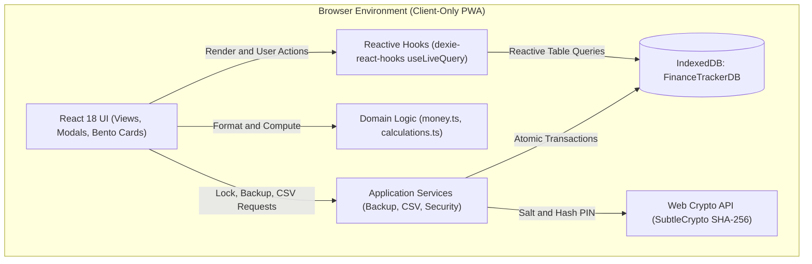

# Balangay: Offline-First Personal Finance Tracker

> A private, 100% offline-first personal finance tracker tailored for the Philippine Peso (PHP ₱, `en-PH`).

<p align="center">
  
  
  
  
  
  
</p>

## Overview

Balangay is a client-only Progressive Web App (PWA) designed for tracking personal finances without sending any financial data across the internet. Built around the Philippine financial context, it handles accounts, expenses, incomes, and fund transfers natively in Philippine Peso (PHP ₱).

All records are stored directly in your browser using IndexedDB via Dexie.js. There is no remote backend, no cloud database, no telemetry, and no external tracking. Your financial records never leave your device unless you choose to export them.

## Tech Stack

| Area | Technology | Role in Project |
| :--- | :--- | :--- |
| **Framework** | React 18.3.1 | Component structure, hooks, and client-side view routing |
| **Language** | TypeScript 5.7.2 | Strict static typing and domain invariants |
| **Build Tool** | Vite 6.1.0 | Fast module development server and production bundler |
| **Data Storage** | Dexie.js 4.0.11 & IndexedDB | Reactive client-side persistence and index management |
| **Styling** | Tailwind CSS 3.4.17 | Utility styling and custom design tokens |
| **Security** | Web Crypto API (`SubtleCrypto`) | Cryptographic salt generation and SHA-256 PIN hashing |
| **Testing** | Vitest 3.0.5 & Testing Library | Unit, integration, and database test suites |
| **Offline / PWA** | `vite-plugin-pwa` 0.21.1 | Service worker caching and installable web application |

## Features

- **100% Offline Vault**: Instant reads and writes through IndexedDB using Dexie.js. The app functions without an internet connection.
- **Philippine Peso Currency Engine**: Built specifically for the `en-PH` locale with half-up rounding (`roundMoney()`) to eliminate IEEE 754 floating-point inaccuracies.
- **Bento Dashboard**: Net worth summary, cashflow breakdown (income vs. expense), daily spending velocity, and category budget gauges.
- **Account Management**: Separate tracking for cash, bank accounts, e-wallets, credit lines, and savings goals, including cross-account transfers.
- **Transaction Ledger**: Categorized records with date grouping, search filters, and contextual mood tags (Essential, Treat, Invest, Peaceful).
- **Category Budgets**: Monthly spending caps with proactive visual alerts at 80% threshold and over-budget states.
- **Local PIN Lock**: Optional 4 to 6 digit security PIN hashed via Web Crypto SHA-256 with 16-byte random salt and constant-time verification. Supports auto-lock timeouts (1, 5, or 15 minutes).
- **Data Portability**: Versioned atomic backup exports and restores in JSON format, alongside RFC 4180-compliant CSV export and import.
- **Installable PWA**: Standalone installation support on desktop and mobile browsers.

## Architecture

Balangay enforces a strict separation of layers to maintain offline reliability:



### Layer Responsibilities

1. **Domain Layer (`src/domain/`)**: Pure TypeScript contracts and financial calculations. It does not import storage or UI modules. All currency operations use `formatPHP()` and `roundMoney()`.
2. **Storage Layer (`src/storage/`)**: Dexie singleton database schema (`FinanceTrackerDB`), table indexing (`accounts`, `transactions`, `categories`, `settings`), and repository query methods.
3. **Services Layer (`src/services/`)**: Stateless application services managing cryptographic PIN verification (`securityService.ts`), atomic JSON backup envelopes (`backupService.ts`), and RFC 4180 CSV parsing (`csvService.ts`).
4. **Presentation Layer (`src/components/`, `src/context/`)**: Feature views (`dashboard`, `transactions`, `budgets`, `accounts`, `settings`), security context, and UI primitives styled via Tailwind CSS.

## Getting Started

### Prerequisites

- **Node.js**: v18.0.0 or higher
- **npm**: v9.0.0 or higher

### Installation

Clone the repository and install dependencies:

```bash
git clone https://github.com/bonje-manza/balangay.git
cd balangay
npm install
```

### Development Server

Start the Vite development server with Hot Module Replacement (HMR):

```bash
npm run dev
```

The application will be accessible at `http://localhost:5173`.

### Production Build

Typecheck the codebase with TypeScript and compile the production bundle:

```bash
npm run build
```

To preview the production build locally:

```bash
npm run preview
```

## Testing

Balangay includes a comprehensive test suite covering domain logic, IndexedDB storage, security hashing, CSV conversion, and React components. Tests run in a `jsdom` environment backed by `fake-indexeddb`.

Run the full test suite once:

```bash
npm test
```

Run tests in watch mode during development:

```bash
npm run test:watch
```

Run a single targeted test file:

```bash
npx vitest run src/domain/money.test.ts
```

## Project Structure

```text
balangay/
├── public/                 # Static icons and PWA manifest assets
├── src/
│   ├── components/         # Feature modules and UI primitives
│   │   ├── accounts/       # Account ledger and fund transfer modals
│   │   ├── budgets/        # Category budget cards and progress bars
│   │   ├── dashboard/      # Bento summary metrics, cashflow charts, velocity
│   │   ├── navigation/     # Header bar and floating bottom navigation
│   │   ├── onboarding/     # First-run setup and default account seeding
│   │   ├── pwa/            # Progressive Web App installation prompt
│   │   ├── security/       # PIN lock screen and credential entry dialogs
│   │   ├── settings/       # Preferences, auto-lock timeout, and data wipe
│   │   ├── transactions/   # Transaction list, filter bar, and record modal
│   │   └── ui/             # Reusable Neo-Brutalist cards, buttons, and toasts
│   ├── context/            # React context providers (SecurityContext)
│   ├── domain/             # Pure domain models, currency math, and invariants
│   ├── services/           # PIN hashing, atomic JSON backup, and CSV routines
│   ├── storage/            # Dexie schema, repository functions, and seed data
│   ├── test/               # Vitest environment setup and test utilities
│   ├── App.tsx             # Application shell, routing state, and live queries
│   ├── index.css           # Tailwind CSS directives and custom typography
│   └── main.tsx            # React application entry point
├── index.html              # HTML entry point with font preconnects and theme color
├── package.json            # Scripts and project dependencies
├── tailwind.config.js      # Design system color tokens, radii, and typography
├── tsconfig.json           # Strict TypeScript configuration
├── vite.config.ts          # Vite build options and PWA service worker settings
└── vitest.config.ts        # Vitest configuration with jsdom environment
```

## Security and Privacy

Balangay operates under a strict privacy-first model:

- **Zero Network Footprint**: No backend servers, external APIs, telemetry, or third-party analytics are configured.
- **Local Storage Isolation**: All account balances, transactions, and categories reside solely in browser IndexedDB on your device.
- **Cryptographic PIN Protection**: Optional vault locking uses the browser Web Crypto API (`SubtleCrypto`). PINs are hashed using SHA-256 alongside a cryptographically random 16-byte salt, and verification uses constant-time string comparison to prevent timing attacks.
- **Atomic Data Resets**: Full database wipe routines are provided in Settings, allowing users to clear all local records instantly.

## Backup and Data Export

To ensure your financial data is never locked into a single device or browser:

1. **JSON Snapshot**: Full database export into a versioned JSON envelope (`backupService.ts`). Importing a backup executes as an atomic IndexedDB transaction, validating structure before replacing records.
2. **CSV Export and Import**: RFC 4180-compliant CSV export for transaction records, compatible with spreadsheet applications such as Excel, Numbers, and Google Sheets.

## License

This repository is marked as private in `package.json`. All rights are reserved by the repository owner unless an open-source license is added.
